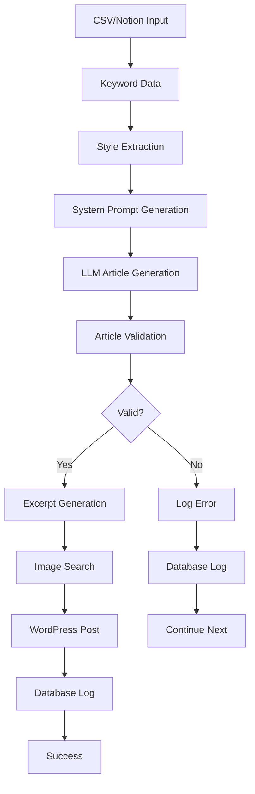
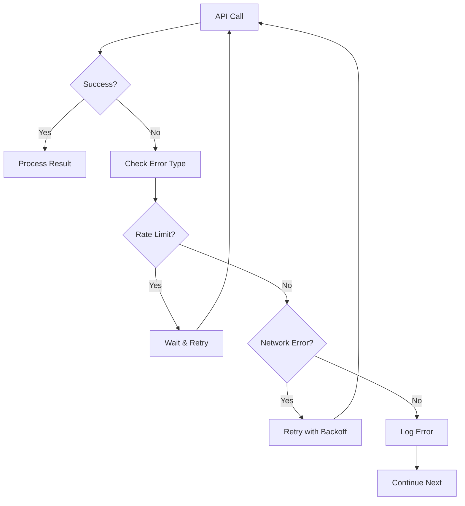

# システムアーキテクチャ

## 概要

wp-gamingpc-longtail-juraは、モノレポ構造を持つTypeScriptベースのシステムです。ジュラ文体の記事を自動生成し、WordPressに投稿する機能を提供します。

## アーキテクチャ図

```
┌─────────────────┐    ┌─────────────────┐    ┌─────────────────┐
│   CLI Layer     │    │   Core Layer    │    │  External APIs  │
│                 │    │                 │    │                 │
│ ┌─────────────┐ │    │ ┌─────────────┐ │    │ ┌─────────────┐ │
│ │   CLI App   │ │    │ │Article Gen. │ │    │ │   OpenAI    │ │
│ └─────────────┘ │    │ └─────────────┘ │    │ └─────────────┘ │
│                 │    │ ┌─────────────┐ │    │ ┌─────────────┐ │
│ ┌─────────────┐ │    │ │Style Extr.  │ │    │ │ WordPress   │ │
│ │  Inquirer   │ │    │ └─────────────┘ │    │ └─────────────┘ │
│ └─────────────┘ │    │ ┌─────────────┐ │    │ ┌─────────────┐ │
│                 │    │ │   Services  │ │    │ │  Unsplash   │ │
│ ┌─────────────┐ │    │ └─────────────┘ │    │ └─────────────┘ │
│ │  Commander  │ │    │ ┌─────────────┐ │    │ ┌─────────────┐ │
│ └─────────────┘ │    │ │   Utils     │ │    │ │   Notion    │ │
└─────────────────┘    │ └─────────────┘ │    │ └─────────────┘ │
                       │ ┌─────────────┐ │    ┌─────────────────┘
                       │ │  Database   │ │
                       │ └─────────────┘ │
                       └─────────────────┘
```

## レイヤー構造

### 1. CLI Layer (`packages/cli`)

ユーザーインターフェースを提供するレイヤーです。

#### 主要コンポーネント

- **CLI App**: Commander.jsを使用したコマンドラインインターフェース
- **Inquirer**: 対話的なユーザー入力の処理
- **Configuration Loader**: 環境変数の読み込みと検証

#### 責任

- コマンドライン引数の解析
- ユーザー入力の収集
- 設定の読み込みと検証
- エラーハンドリングとユーザーフィードバック

### 2. Core Layer (`packages/core`)

ビジネスロジックとデータ処理を担当するレイヤーです。

#### 主要コンポーネント

##### Article Generator
記事生成のメインロジックを管理します。

```typescript
class ArticleGenerator {
  async generateFromCSV(csvPath: string): Promise<void>
  async generateFromNotion(notionService: NotionService): Promise<void>
  async processKeyword(keywordData: KeywordData, systemPrompt: string): Promise<void>
}
```

##### Services
外部APIとの通信を管理します。

- **LLMService**: OpenAI APIとの通信
- **WordPressService**: WordPress REST APIとの通信
- **UnsplashService**: Unsplash APIとの通信
- **NotionService**: Notion APIとの通信
- **StyleExtractor**: ジュラ文体の特徴抽出

##### Utils
共通のユーティリティ機能を提供します。

- **RateLimiter**: APIレート制限の管理
- **RetryHandler**: リトライロジックの実装
- **CSVParser**: CSVファイルの解析
- **Database**: SQLiteデータベースの操作

#### 責任

- 記事生成ロジックの実行
- 外部APIとの通信
- データの永続化
- エラーハンドリングとリトライ

### 3. External APIs

外部サービスとの統合を提供します。

#### OpenAI API
- **用途**: 記事生成、要約生成、記事検証
- **制限**: レート制限（60 requests/minute）
- **モデル**: GPT-4（デフォルト）

#### WordPress REST API
- **用途**: 記事投稿、メディアアップロード
- **認証**: Basic認証（アプリケーションパスワード）
- **制限**: 30 requests/minute

#### Unsplash API
- **用途**: アイキャッチ画像の取得
- **認証**: Client ID
- **制限**: 50 requests/hour

#### Notion API
- **用途**: キーワードデータの取得
- **認証**: Bearer Token
- **制限**: 3 requests/second

## データフロー

### 1. 記事生成フロー



### 2. エラーハンドリングフロー



## データモデル

### KeywordData
```typescript
interface KeywordData {
  keyword: string;      // ターゲットキーワード
  overview: string;     // 記事概要
  tone_hint: string;    // トーンヒント
  cta: string;          // CTAリンク
}
```

### ArticlePost
```typescript
interface ArticlePost {
  title: string;        // 記事タイトル
  content: string;      // 記事本文
  excerpt: string;      // 記事要約
  status: 'draft' | 'publish' | 'future';
  categories: number[]; // カテゴリID
  tags: string[];       // タグ
  featured_media?: number; // アイキャッチ画像ID
  date?: string;        // 投稿日時
}
```

### DatabasePost
```typescript
interface DatabasePost {
  id?: number;          // データベースID
  keyword: string;      // キーワード
  title: string;        // タイトル
  wp_post_id?: number;  // WordPress投稿ID
  wp_link?: string;     // WordPressリンク
  status: 'generated' | 'posted' | 'failed';
  created_at: string;   // 作成日時
  posted_at?: string;   // 投稿日時
  error_message?: string; // エラーメッセージ
}
```

## セキュリティ考慮事項

### 1. API認証
- 環境変数による機密情報の管理
- アプリケーションパスワードの使用（WordPress）
- Bearer Token認証（Notion）

### 2. レート制限
- 各APIの制限に合わせたレート制限の実装
- 指数バックオフによるリトライ

### 3. エラーハンドリング
- 機密情報のログ出力を避ける
- 適切なエラーメッセージの提供

## パフォーマンス考慮事項

### 1. 並行処理
- キーワード処理の順次実行（API制限のため）
- 非同期処理によるI/O待機時間の最小化

### 2. キャッシュ
- スタイル抽出結果のキャッシュ
- データベース接続の再利用

### 3. メモリ管理
- 大きなファイルのストリーミング処理
- 適切なリソースの解放

## 拡張性

### 1. 新しい入力ソースの追加
- 新しいServiceクラスの実装
- インターフェースの統一

### 2. 新しい出力先の追加
- 新しい投稿先のService実装
- 共通インターフェースの定義

### 3. 新しい文体の追加
- StyleExtractorの拡張
- コーパスディレクトリの追加

## 監視とログ

### 1. ログレベル
- ERROR: エラー情報
- WARN: 警告情報
- INFO: 一般的な情報
- DEBUG: デバッグ情報

### 2. メトリクス
- 投稿成功率
- API呼び出し回数
- 処理時間
- エラー率

### 3. アラート
- API制限の接近
- エラー率の上昇
- 処理時間の異常

## デプロイメント

### 1. 開発環境
- ローカルでの実行
- 環境変数による設定
- ホットリロード対応

### 2. 本番環境
- Docker化の推奨
- 環境変数の管理
- ログの集約

### 3. CI/CD
- GitHub Actionsによる自動テスト
- コード品質チェック
- 自動デプロイメント 